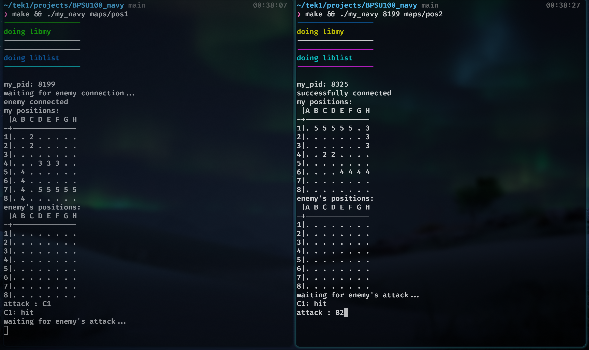

# My Navy ⚓

## Game Preview 📸


## Overview 🌟
"My Navy" is a terminal-based game inspired by the classic Battleship game. It involves two players communicating with SIGUSER1 and SIGUSER2 signals. The game is played on an 8x8 grid, where players take turns to attack each other's navy.

## Features 🛠️
- **Game Mechanics**: Players input coordinates to target the opponent's ships.
- **Signal-Based Communication**: Utilizes SIGUSER1 and SIGUSER2 for player interaction.
- **Terminal-Based Interface**: Runs in the terminal, showing player and enemy grids.
- **Error Handling**: Specifically handles errors, especially for incorrect navy file inputs.

## Enhancements 🚀
- **AI Opponent**: An AI option for single-player mode.
- **Customizable Settings**: Options to customize game rules and mechanics.
- **Multiplayer Mode**: Allows for more than two players.

## Reflection 💭
A modern twist on Battleship, challenging players to strategize in a terminal-based setting.

## Prerequisites 📋
- **GCC**: The game is developed in C.
- **Makefile**: For compiling with specific rules.
- **Linux Signals**: Familiarity with SIGUSER1 and SIGUSER2 signals is required.

## How to Use 🖥️
Maps must be in this form :
```bash
2:C1:C2
3:D4:F4
4:B5:B8
5:D7:H7

```
Launch the game with:
```bash
FIRST USER :
./my_navy navy_positions
```
```bash
SECOND USER :
./my_navy [pid from first user] navy_positions
```
## Winning the Game 🏆
The game concludes when all of a player's ships are hit. The terminal announces the winner.
